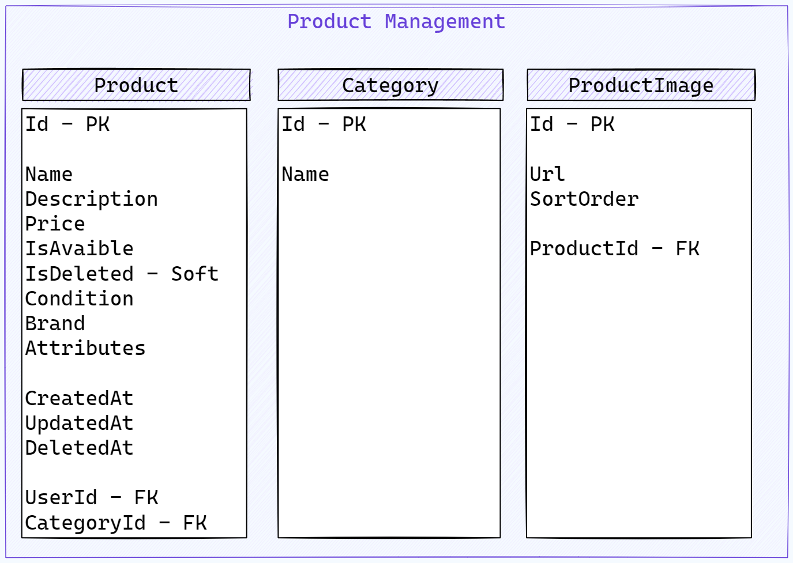
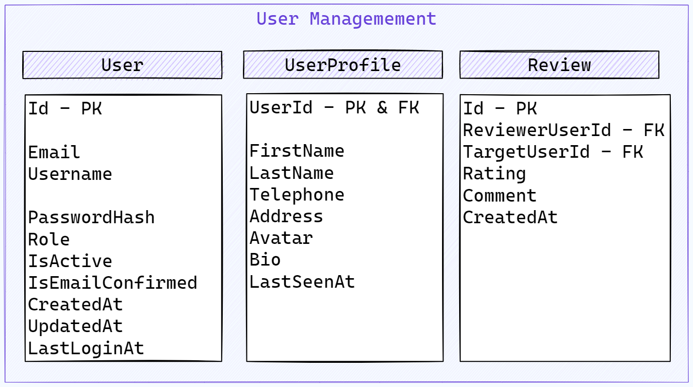
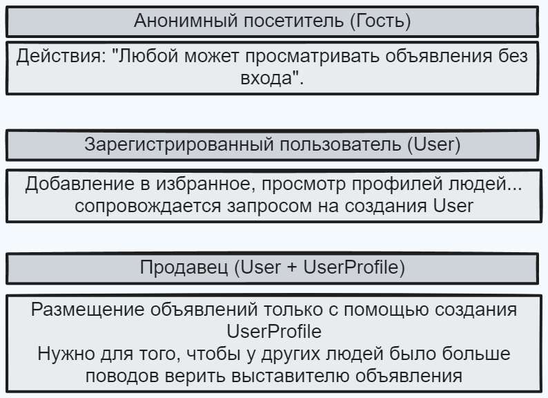

# InnoShop

Система для Userов выглядит так

# ТЗ
## 1. Введение
   Проект "Inno_Shop" представляет собой систему, состоящую из двух микросервисов, предназначенных для управления пользователями и их продуктами. Эти микросервисы должны быть разработаны с использованием ASP.NET Core и взаимодействовать через API.

## 2. Основные требования

### 2.1. Первый Микросервис "Управление пользователями"
      
- Микросервис должен предоставлять RESTful API для создания, чтения, обновления и удаления пользователей.
    
  - Каждый пользователь должен иметь следующие атрибуты: идентификатор (ID), имя, адрес электронной почты, роль и т. д.
     
 - Микросервис должен обеспечивать аутентификацию и авторизацию пользователей с использованием токенов доступа.
     
 - Должны быть предусмотрены механизмы восстановления паролей.
    
 - Должен быть предусмотрен механизм подтверждения аккаунта через почту.

- Должна быть предусмотрена роль Админа для того чтобы управлять пользователями (деактивация/активация)
     
 - Если мы деактивируем пользователя мы должны скрыть все его продукты (Подумать по поводу использования SoftDelete на стороне микросервиса продуктов чтобы при активации пользователя все продукты появились снова)

### 2.2. Второй Микросервис "Управление продуктами"

- Микросервис должен предоставлять RESTful API для создания, чтения, обновления и удаления продуктов.

- Каждый продукт должен иметь атрибуты, такие как идентификатор (ID), название, описание, цена, доступность, ID пользователя создавшего товар, дата создания и т. Д.

- Микросервис должен обеспечивать возможность поиска продуктов и фильтрации по различным параметрам.

- Должны быть предусмотрены механизмы обработки ошибок и валидации данных. (Fluent Validation, Problem Details as Exception handler or Custom global exception middleware)

- Добавлять, Удалять, Редактировать продукты могут только авторизованные пользователи. Так же все эти операции пользователь может проводит только со своими продуктами.

## 3. Технические требования

### 3.1. Технологии и стек
- Микросервис "Управление пользователями" и "Управление продуктами" должны быть разработаны с использованием ASP.NET Core.
- Взаимодействие между микросервисами должно быть реализовано с использованием RESTful API.
- Для аутентификации и авторизации пользователей следует использовать JWT (JSON Web Tokens).
- Для хранения данных микросервиса можно использовать СУБД (например, PostgreSQL, SQL Server).
- Для доступа к базам данных желательно использовать Entity Framework, Code First подход. 

### 3.2. Развертываемость
- Микросервисы должны быть спроектированы с учетом возможности запуска в докер (Docker/docker-compose). База данных должна быть тоже часть docker compose файла.

### 3.3. Тестирование
- Предусмотрите unit-тестирование и интеграционное тестирование для обоих микросервисов.
    

## 4. Структура проекта
- Проект должен быть структурирован в соответствии с хорошими практиками для ASP.NET Core приложений (Для примера: Clean/Onion).

## 5. Будет БОЛЬШИМ плюсом наличие FrontEnd

