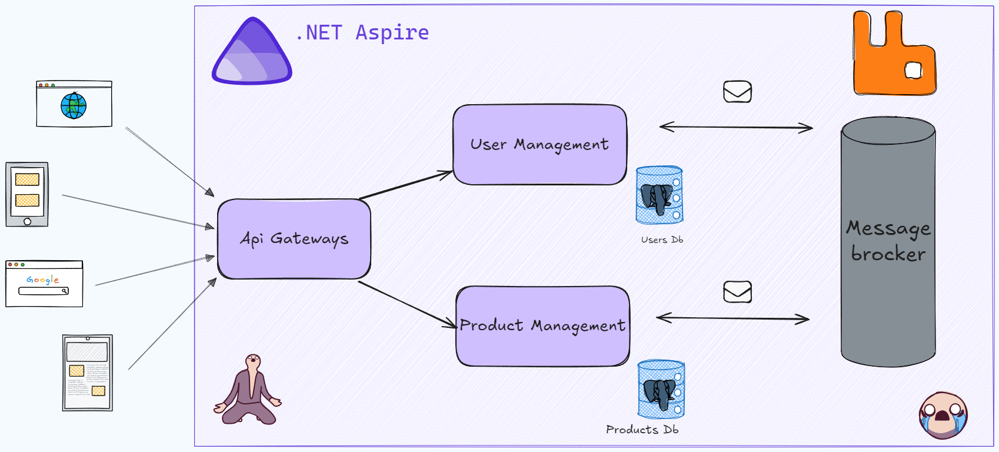
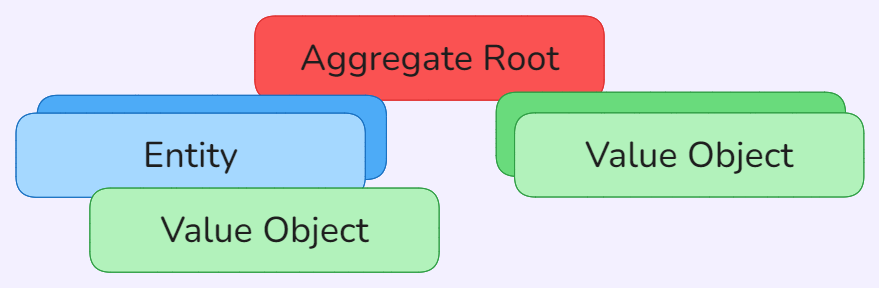
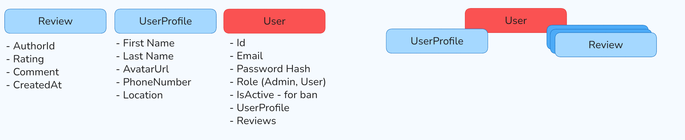
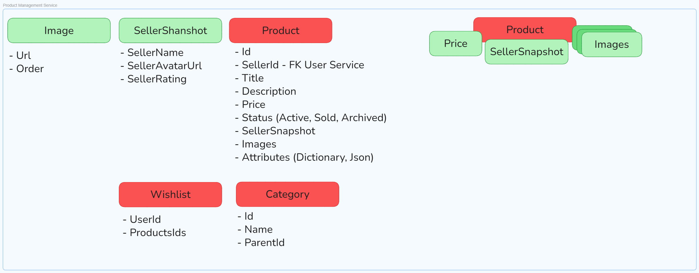
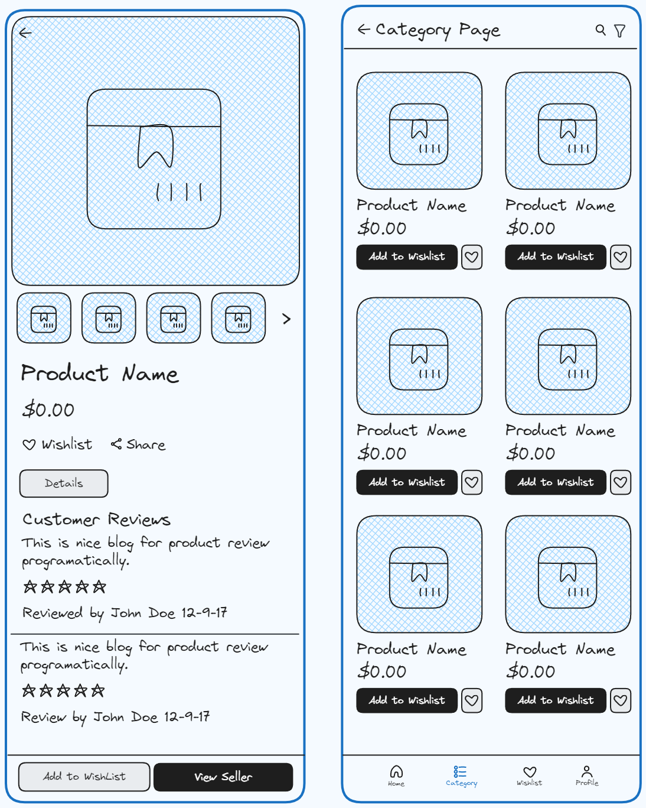

К СОЖАЛЕНИЮ ЗАВЕРШИТЬ ПРОЕКТ НЕ ПОЛУЧИЛОСЬ, не правильно рассчитала свои знания и возможности🥹
из реализованного `User Management`
интеграционные евенты не воркают, не успела их довести до рабочего состояния
все ендпоинты что есть, положены в соответствующие папки `requests`, в swagger с  jwt не получится

user management делала сама, а уже при проектировании product management прибегнула к cursor, чтобы быстро имплементнуть тоже самое, но времени уже не хватило
тесты в user management работают, создавала их в начале, так что некоторые вещи могут быть не понятны, а начиналось так красиво...

# 📱 InnoShop

**Современная микросервисная платформа электронной коммерции**

  <a href="#-архитектура">Архитектура</a> •
  <a href="#-технический-стек">Стек</a> •
  <a href="#-проектирование-домена-ddd">DDD</a> •
  <a href="#-ui--ux-концепт">Интерфейс</a> •
  <a href="#-техническое-задание">ТЗ</a>

---

## 📖 О проекте

**InnoShop** - учебный проект магазина б/у гаджетов, построенный на .NET 10, .NET Aspire и принципах DDD/Clean
Architecture.

---

## 🏗 Архитектура

В основе системы лежит оркестратор **.NET Aspire**, управляющий жизненным циклом сервисов. Коммуникация между User
Service и Product Service осуществляется через шину сообщений RabbitMQ, а данные хранятся в изолированных базах
PostgreSQL.

  

---

## 🚀 Технический стек

| Категория         | Технологии                                             |
|:------------------|:-------------------------------------------------------|
| **Core**          | `ASP.NET Core Web API`, `.NET Aspire`                  |
| **Architecture**  | `Clean Architecture`, `DDD`, `CQRS (MediatR)`          |
| **Database**      | `PostgreSQL` (Database-per-service), `EF Core`         |
| **Messaging**     | `RabbitMQ` (MassTransit)                               |
| **Caching**       | `Redis` (Distributed Cache)                            |
| **Storage**       | `MinIO` (S3 Compatible Object Storage)                 |
| **Communication** | `REST` (Sync), `Message Bus` (Async)                   |
| **Tools**         | `MailKit` + `Mailpit` (SMTP Testing), `Docker Compose` |

---

## 🧩 Проектирование Домена (DDD)

Архитектура приложения строго следует принципам Domain-Driven Design, разделяя логику на агрегаты, сущности и
объекты-значения (Value Objects).

  <h3>Общая концепция сущностей</h3>
  

 

### 👤 User Management Service

Микросервис, отвечающий за управление пользователями, безопасную аутентификацию и систему отзывов.

  
<b>📸 Показать схему домена User</b>

   
  

    
  

### 📦 Product Management Service

Микросервис каталога товаров. Управляет продуктами, категориями, ценами и списками желаемого. Хранит денормализованную
реплику данных о продавце для оптимизации чтения.

  
<b>📸 Показать схему домена Product</b>

   
  

    
  

---

## 🎨 UI / UX Концепт

Визуализация клиентской части приложения.

  

---

## 📄 Техническое задание

Подробное описание функциональных требований, пользовательских сценариев и API контрактов доступно в документации.

